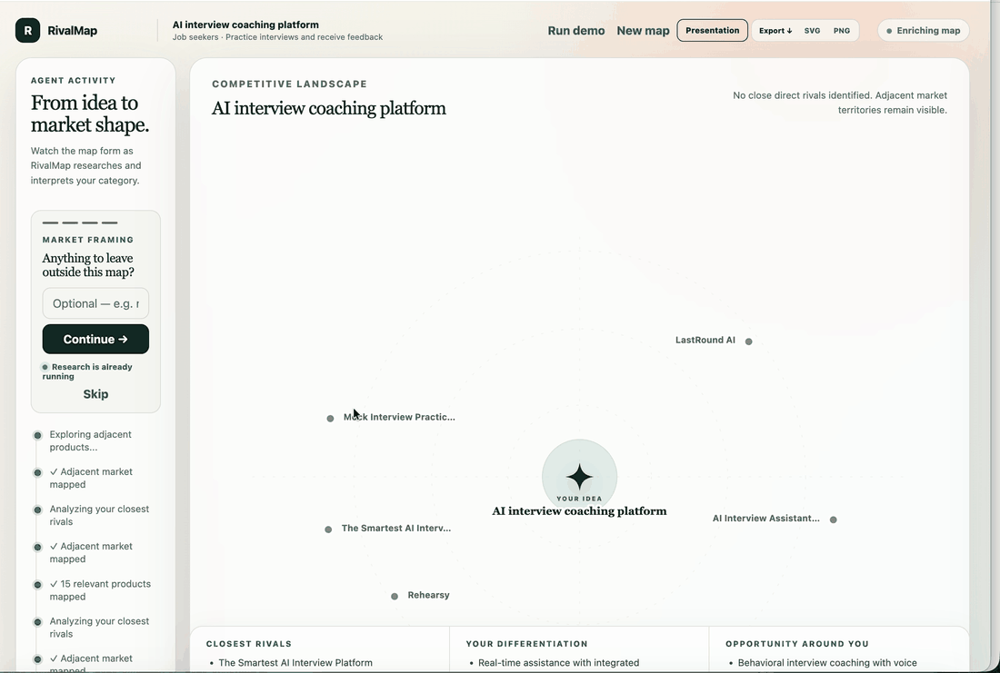
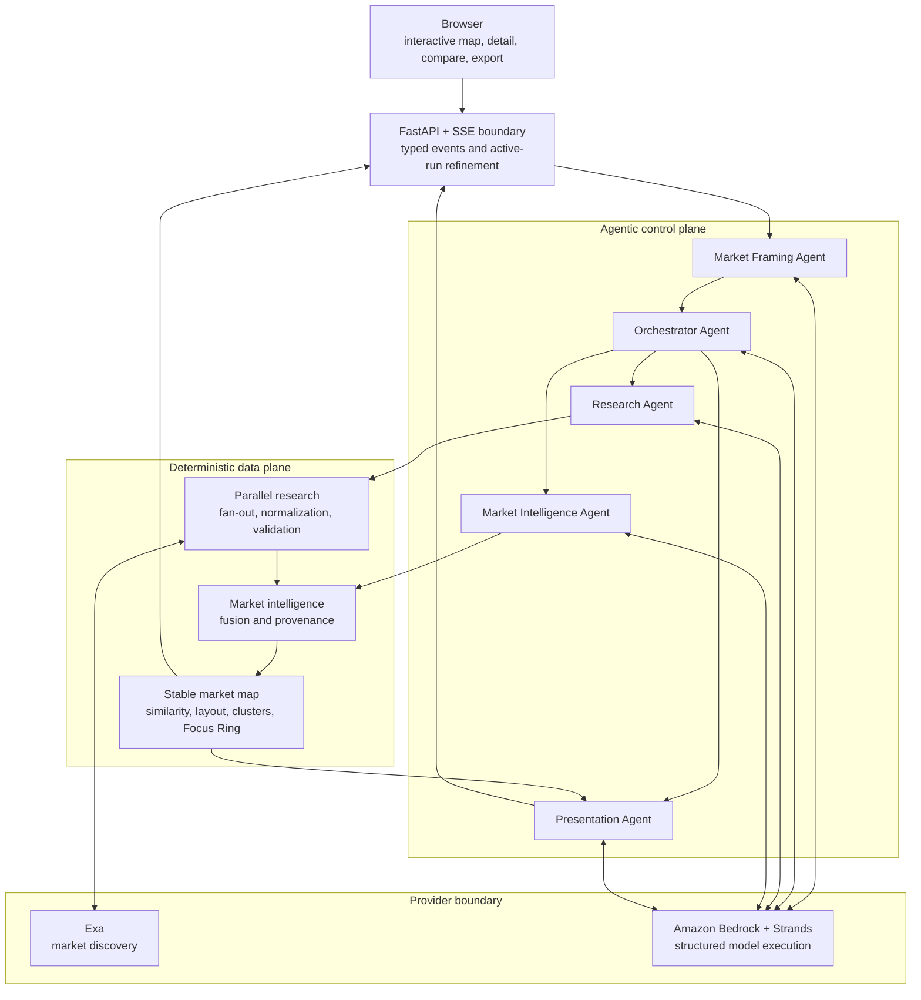
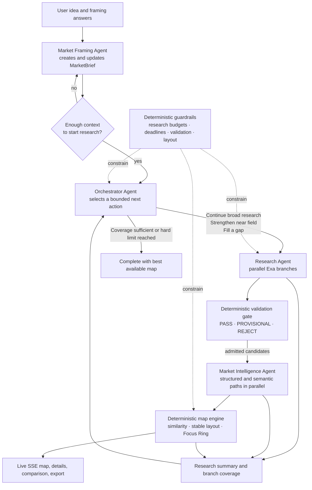

# RivalMap

**RivalMap is an agentic competitive-intelligence workspace that turns a product idea into an evidence-backed, interactive market map.**

It researches a market in parallel, validates candidate products, analyzes the ones worth keeping, and progressively maps the competitors closest to a user's idea. The first useful market view arrives before research is complete; the map continues to enrich as new evidence arrives.

Built as an independent AI engineering project, RivalMap combines bounded multi-agent orchestration, live web research, typed model outputs, deterministic market geometry, and a presentation-ready frontend.

## Live demo

[Open RivalMap](http://35.87.124.199/) · [Run Demo](http://35.87.124.199/?demo=1)

[](http://35.87.124.199/?demo=1)

*Recorded demo excerpt, played at approximately 2× speed. Watch the market expand, inspect a competitor, and add it to Compare. Click the animation to try the live demo.*

## What it does

RivalMap helps founders and product teams answer three questions: **Who competes with my idea? How are we different? Where could we stand out?**

Describe what you want to build, who it is for, and the problem it solves. RivalMap's agents research the market and turn their findings into an interactive competitive map you can explore while research continues.

- **Discover competitors you might have missed.** Find direct rivals, adjacent products, and alternative ways customers solve the same problem.
- **See where your idea fits.** Your product stays at the center of the map. Nearby competitors show the strongest feature similarity, while the Focus Space highlights rivals worth a closer look based on relevance, evidence, and profile quality.
- **Understand each product.** Click a competitor to explore its target customers, workflows, capabilities, positioning, differentiators, and available pricing information, with links to supporting sources.
- **Compare rivals against your idea.** Select two to four products for a side-by-side comparison anchored on your own concept. See supported overlaps and differences, with a concise takeaway to inform positioning decisions.
- **Explore before research finishes.** Competitors appear as they are analyzed, so you can start inspecting the map while RivalMap adds more market context. Refine the research scope without starting over.
- **Take the findings into a team discussion.** Review three concise perspectives—Closest Rivals, Your Differentiation, and Opportunity Around You—then export the map as PNG or SVG for a strategy deck.

Findings stay linked to their sources, and incomplete evidence is made visible so you can distinguish supported facts from open questions.

## Architecture

RivalMap is organized as two cooperating planes:

- The **agentic control plane** decides which bounded work is worth doing next.
- The **deterministic data plane** validates evidence, analyzes admitted products,
  and produces repeatable map updates.

The frontend consumes those updates as an SSE stream; Bedrock and Exa stay behind
provider boundaries rather than leaking into product or map logic.



### Agent responsibilities

| Agent | Responsibility | Does not do |
| --- | --- | --- |
| Market Framing Agent | Converts explicit user input into a typed `MarketBrief`; asks one concise question at a time. | Invent missing market facts. |
| Orchestrator Agent | Chooses the next bounded research direction: `CONTINUE_BROAD`, `STRENGTHEN_NEAR_FIELD`, `FILL_GAP`, or `COMPLETE`. | Approve individual candidates or override hard limits. |
| Research Agent | Calls the concurrent Exa research service and can request targeted follow-up waves. | Validate, analyze, or position products. |
| Market Intelligence Agent | Interprets admitted evidence with structured and semantic analysis paths. | Change map coordinates, similarity, clusters, or Focus Ring membership. |
| Presentation Agent | Produces concise labels, callouts, and comparison-ready metadata from the current model. | Invent research, rankings, or geometry. |

Strands provides the agent framework and Amazon Bedrock provides injectable, role-specific models. The agents expose typed, validated outputs; raw reasoning and traces are never sent to the frontend.

## Inside the agentic control plane

RivalMap is not a fixed search-and-summarize chain. Its Orchestrator continuously chooses the next bounded research direction from coverage, near-field quality, elapsed time, and remaining budgets. Meanwhile, admitted candidates flow directly through analysis and into the map; they never wait for a final orchestration decision.

Internally, this is a hierarchical tool pattern—not a free-form agent swarm:
the Framing Agent owns the evolving user context, the Orchestrator owns
high-level direction, and the specialist agents invoke the tested services
within their narrow responsibilities.



This is bounded agentic automation: agents choose *what to do next* within explicit tool boundaries, while deterministic services preserve repeatability, evidence handling, safety limits, and stable visual output.

The user sees their idea as the strategic anchor. Nearby, high-confidence competitors form the Focus Ring; adjacent and broader-market products remain as lower-emphasis context. Every mapped product can be opened for its available facts, semantic relationship, confidence, and supporting sources.


## How a run works

### 1. Frame the market

The user supplies an idea and can add a target customer and problem. Once the target customer and problem are known, research can begin even if later framing answers are still arriving.

### 2. Find and validate candidates

The research service fans out independent Exa queries across four deterministic branches:

- Direct competitors
- Adjacent competitors
- Category and product discovery
- Alternative or substitute workflows

Each query has its own timeout. A slow or failed provider response does not block successful branches. Candidate identities, titles, domains, and URLs are normalized and deduplicated with stable IDs. The validation gate evaluates product identity, relevance, evidence coverage, identity confidence, and source quality before a candidate is admitted.

### 3. Analyze each admitted product

For every `PASS` candidate—and selected `PROVISIONAL` candidates—two paths run concurrently:

| Path | Output |
| --- | --- |
| Structured analysis | identity, target users, category, use case, capabilities, workflow, pricing signals, integrations, business model, confidence, and evidence IDs |
| Semantic analysis | problem solved, positioning, differentiators, relationship to the user's idea, relevance explanation, and uncertainties |

The fusion layer preserves provenance, exposes uncertain or missing facts, and does not silently overwrite conflicts. A failure in one path produces a partial profile rather than dropping the candidate.

### 4. Build a stable market map

`StableMarketMap` creates a deterministic feature representation from the enriched profile and the `MarketBrief`.

- **Distance to the center** is based on product-to-user feature similarity.
- **Direction** comes from a fixed deterministic 2D projection, so similar feature representations tend to occupy nearby regions.
- **Semantic relationship** (`DIRECT`, `ADJACENT`, `ALTERNATIVE`, `UNKNOWN`) is deliberately separate from geometry. It informs Focus Ring priority and explanations, not placement distance.
- **Existing coordinates stay fixed.** New products are projected out of sample and pass deterministic collision avoidance.
- **Clusters** are lightweight, stable category territories rather than a separate opaque ML clustering layer.

After three analyzed products by default, RivalMap emits `INITIAL_READY`. It can then continue to enrich the map without replacing it.

### 5. Stream useful output early

The backend emits typed, high-level events such as:

```text
framing_started
market_brief_updated
research_requested
candidate_found
candidate_validated
structured_analysis_complete
semantic_analysis_complete
product_profile_ready
presentation_update
orchestration_complete
```

The frontend merges `VisualizationDelta` updates incrementally. It does not wait for a final research decision before it can show an actionable map.

## Design principles and safeguards

- **Evidence first.** Supporting sources survive discovery, analysis, product detail, compare, and export flows.
- **Deterministic where it matters.** Validation policy, research budgets, similarity, layout, collision avoidance, and Focus Ring selection do not rely on an LLM choosing arbitrary results.
- **Model boundaries are explicit.** Bedrock model IDs, per-agent token limits, temperatures, retries, and timeouts are configured through environment variables.
- **Bounded autonomy.** The orchestrator decides direction using aggregate metrics, but deterministic hard budgets prevent infinite loops.
- **Graceful degradation.** Partial Exa failures, malformed outputs, or one failed intelligence path preserve the useful work that completed.
- **No long-term memory or agent chat.** Runs are purposefully bounded. Active brief refinement is short-lived and only updates an in-progress run.

## Tech stack


- **Backend:** Python, FastAPI, Pydantic
- **Agents:** Strands Agents, Amazon Bedrock
- **Research:** Exa
- **Concurrency:** bounded `ThreadPoolExecutor` fan-out for research and per-candidate intelligence work
- **Transport:** server-sent events (SSE)
- **Frontend:** dependency-free HTML, CSS, and JavaScript map UI
- **Deployment:** Uvicorn behind Nginx, with systemd configuration included

## Quick start

### Requirements

- Python 3.11+
- An Exa API key for live research
- AWS credentials available through the standard AWS credential chain, with Amazon Bedrock model access

### Install and configure

```bash
git clone https://github.com/ViviLoveAI/RivalMap.git
cd RivalMap

python3 -m venv .venv
. .venv/bin/activate
pip install -e '.[dev]'

cp .env.example .env
```

Set these values in `.env`:

```bash
EXA_API_KEY=your_exa_key
RIVALMAP_AWS_REGION=us-west-2
RIVALMAP_BEDROCK_MODEL_ID=your_enabled_bedrock_model_or_inference_profile
```

Do not put AWS access keys in `.env`. RivalMap uses the standard AWS credential chain, including an EC2 instance role in production.

### Start the app

```bash
uvicorn server:app --reload --host 127.0.0.1 --port 8876
```

Open [http://127.0.0.1:8876/](http://127.0.0.1:8876/) for the app, or [http://127.0.0.1:8876/?demo=1](http://127.0.0.1:8876/?demo=1) for the live-demo entry state.

### Run tests

```bash
python -m pytest -q
ruff check .
```

Live provider tests are intentionally opt-in:

```bash
python -m pytest -m live
```

## Benchmark and telemetry

**Development preview:** The benchmark harness described below is available in local development but is not yet included in the public repository. These commands require that implementation.

RivalMap includes an independent harness for repeatable, live-provider benchmark
runs. It calls the existing progressive vertical slice and collects latency,
research volume, validation yield, Strands token usage, and configurable provider
cost estimates. It does not alter the API, SSE payloads, agent behavior, or map
logic.

Configure the current USD rates in `.env` before treating cost results as an
estimate:

```bash
RIVALMAP_BENCHMARK_BEDROCK_INPUT_USD_PER_MILLION=...
RIVALMAP_BENCHMARK_BEDROCK_OUTPUT_USD_PER_MILLION=...
RIVALMAP_BENCHMARK_EXA_USD_PER_SEARCH=...
```

Run 30 cases, round-robin across the supplied benchmark set:

```bash
python -m rivalmap.benchmark \
  --runs 30 \
  --cases benchmark_cases.example.json \
  --output benchmark-report.json
```

The console report includes completion rate, p50/p95 first result, p50/p95 first
useful map, p50/p95 completion, average search/evidence/candidate/wave counts,
total input/output tokens, Bedrock and Exa cost, cost per run, and cost per
validated product. The JSON output also retains per-run telemetry and failures.
If pricing is omitted, latency and volume metrics still run while cost values are
reported as `n/a` rather than silently estimated.

## API

### Progressive run

`POST /api/v1/runs/stream` returns an SSE stream and includes an `X-RivalMap-Run-Id` response header for lightweight brief refinement.

```bash
curl -N \
  -H 'Content-Type: application/json' \
  -H 'Accept: text/event-stream' \
  --data '{
    "idea": "AI interview coaching platform",
    "target_user": "job seekers",
    "problem": "Practice interviews and receive feedback"
  }' \
  http://127.0.0.1:8876/api/v1/runs/stream
```

### Refine an active run

`POST /api/v1/runs/{run_id}/refine` updates only the live brief's exclusions, competitive scope, or priority dimension. It does not restart completed work.

```json
{
  "exclusions": ["recruiting software"],
  "competitive_scope": "candidate-facing coaching",
  "priority_dimension": "real-time feedback"
}
```

The backward-compatible endpoints remain available:

- `POST /api/runs` returns a final `RivalMapState`.
- `POST /api/runs/stream` returns legacy runtime SSE events.

## Deployment

The repo includes a small EC2 deployment path using an IAM role, systemd, Uvicorn, and Nginx. See [DEPLOY_EC2.md](DEPLOY_EC2.md) for the exact commands and SSE proxy configuration.

The current public deployment is available at [http://35.87.124.199/](http://35.87.124.199/), with the progressive demo entry at [http://35.87.124.199/?demo=1](http://35.87.124.199/?demo=1).

## Project layout

```text
rivalmap/
  contracts.py            Typed contracts and streaming events
  agents.py               Bounded specialist agents and orchestration
  research.py             Concurrent research waves and budgets
  candidate_validation.py Candidate admission gate
  market_intelligence.py  Parallel structured + semantic analysis and fusion
  similarity.py           Explainable feature similarity and Focus Ring
  market_map.py           Stable incremental geometry and clusters
  bedrock.py              Injectable Bedrock / Strands configuration
  vertical_slice.py       Live progressive end-to-end assembly
  api.py                  FastAPI and SSE boundaries
frontend/                 Interactive progressive market-map UI
tests/                    Deterministic unit, API, and integration tests
```

## License

Released under the [MIT License](LICENSE).
